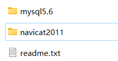

# Library-Management-System

图书管理系统，学弟学妹们记得star和fork哦

功能详见  说明.pdf

## 注意事项

没想到还有挺多人看的，简单修复了一下错误，基本功能应该是没啥问题，学弟学妹们可以自行添加/删除功能。

2024.5.4号更新，4个issues都解决了，现在基本功能应该没啥问题了。

在创建数据库的时候，默认加入了一个管理员，用户名/密码为admin/123456。后面新注册的都是学生用户，密码在数据表里面存储的都是加密后的数据。

数据表里面本来是有挺多条数据的，找不到了。。。大家自己添加几条信息吧，也可以看我上传的视频，看看效果。

## 使用前提

保证已安装mysql数据库。

我记得这门课应该有历代祖传的mysql5.6+navicat。按照提示安装即可。

## 使用方法

1.首先需要单独执行createDB.py来创建数据库。（python环境要有pymsql包）

2.创建好之后执行main.py即可运行。（python环境要有pyqt5）

## 代码文件说明

1. icon文件夹：存放一些小图标。
2. image文件夹：存放一些图片。
3. createDB.py：创建数据库的文件，运行一次把这些表创建就行。会创建一个名为library的数据库，里面有6张表。
4. main.py：程序执行主文件。
5. login.py:登录前端界面代码。
6. signup.py：注册前端界面代码。
7. administrator.py：管理员前端界面代码。
8. book_information.py：管理员前端界面中编辑书本信息的界面代码。
9. student.py：学生前端界面代码。
10. student_information.py：学生前端界面中学生信息界面代码。
11. func.py：所有的后端处理函数。
